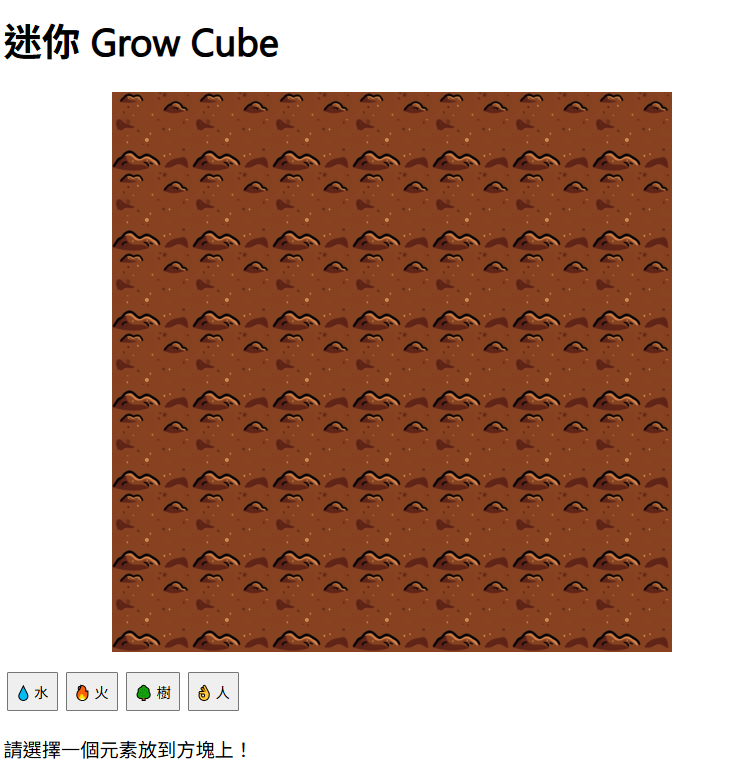

# 🌱 迷你 Grow Cube

一個用 **React + TypeScript** 製作的小型互動遊戲，靈感來自經典的 **Grow Cube**。  
玩家可以選擇不同元素（水、火、樹、人）放到方塊上，觸發動畫與互動效果。

---

## 🎮 遊戲玩法
- 點擊下方按鈕選擇元素：
  - 💧 水
  - 🔥 火
  - 🌳 樹
  - 👌 人
- 每個元素會觸發不同的動畫變化。
- 四種元素皆被放置後，遊戲進入結束狀態，可按下 **Reset** 重新開始。

---

## 🖼️ 遊戲畫面演示


或是你可以來看看 Youtube : https://youtu.be/Ldn-PfVkeDU
---

## 🛠️ 技術棧
- **React** + **TypeScript**
- **CSS 模組化**（簡單樣式）
- **狀態管理**：React Hooks (`useState`, `useEffect`, `useRef`)
- **圖片素材**：Google Gemini 2.5 Flash 製作，本地3D小畫家修改
---

## 📂 專案結構
```
.
├── App.tsx              # 主程式與遊戲邏輯
├── models/
│   ├── Cube.ts          # 遊戲方塊核心邏輯
│   └── CubeElement.ts   # 元素相關設定
├── public/assets/       # 遊戲素材（圖片）
└── styles.css           # 樣式
```

---

## ⚙️ 安裝與執行

```bash
# Clone 專案
git clone https://github.com/your-username/grow-cube-mini.git
cd grow-cube-mini

# 安裝依賴
npm install

# 啟動開發伺服器
npm run start
```

然後打開 [http://localhost:3000](http://localhost:3000) 開始遊玩 🎉

---

## 🚀 遊戲程式邏輯
```
[初始化 Cube] 
      ↓
[玩家點擊元素] → addElement()
      ↓
更新 cube_element
      ↓ (useEffect 觸發)
更新地圖 state & 顯示訊息
      ↓
跑動畫 step (updateState, manGetFire)
      ↓
Cube 更新內部地圖
      ↓
setMap → React 重新渲染
      ↓
若 4 種元素齊全 → Game Over → Reset
```
---

## 🤝 貢獻
歡迎提出 **Issue** 或 **Pull Request**！  

---

## 📜 授權
本專案使用 [MIT License](LICENSE) 授權。
